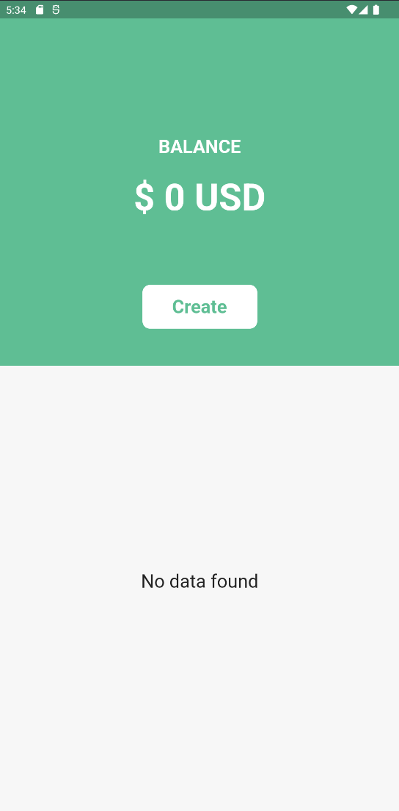
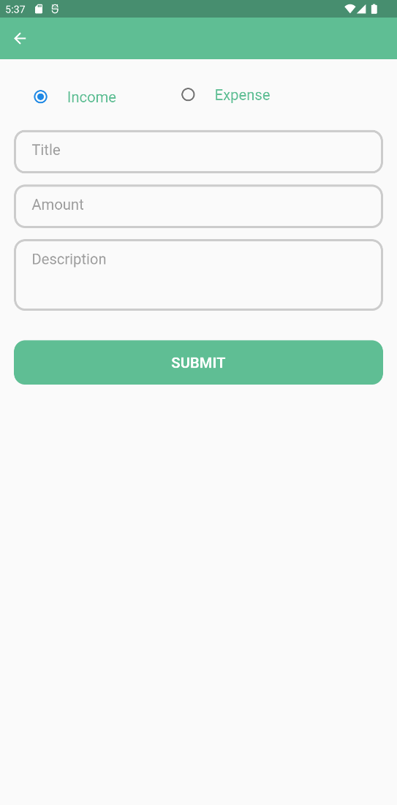
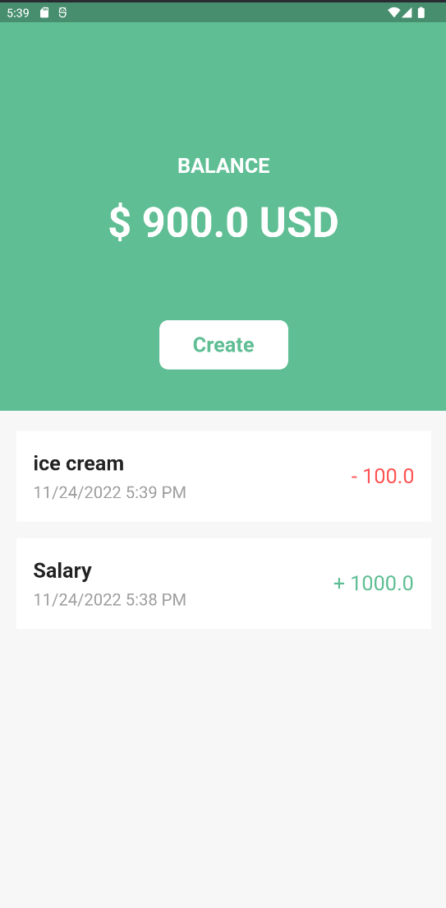

# balance_app

| Name          | Career Path |                         e-mail |
| ------------- | :---------: | -----------------------------: |
| Estrella Poot |   Flutter   | Estrella.Poot@itksquare.edu.mx |

# Unit tests

```bash
flutter test .\test\providers\movement_provider_test.dart
```

# Integration test

```bash
flutter test .\integration_test\full_app_test.dart
```

### 1) Balance Screen



### 2) Create Screen



### 3) Balance Screen with movements



### 4) Delete screen


